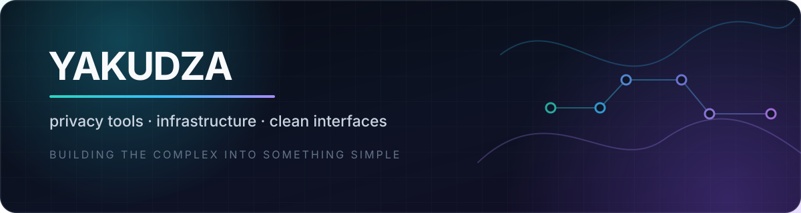

  

  <strong>I turn complicated networking and infrastructure into products people can actually use.</strong>

  
  
  

## What I build

- Privacy and networking tools around **Xray**, VPN infrastructure, and subscriptions
- Clear dashboards and editors for systems that are usually painful to configure
- Full-stack products with a bias toward **reliability, useful UX, and self-hosting**

## Selected work

<table>
  <tr>
    <td width="50%" valign="top">
      <h3><a href="https://github.com/yakudza0708/teapod-stream">TeapodStream</a></h3>
      
A human-friendly Android VPN client powered by Xray, with TUN mode, split tunneling, subscriptions, QR import, and modern transports.

      
<code>Flutter</code> <code>Dart</code> <code>Xray-core</code> <code>Android</code>

    </td>
    <td width="50%" valign="top">
      <h3><a href="https://github.com/yakudza0708/xray-config-ui-editor">Xray Config UI Editor</a></h3>
      
A browser-based visual editor for Xray configurations with Remnawave sync, topology view, Reality tooling, and raw JSON mode.

      
<code>React</code> <code>TypeScript</code> <code>Bun</code> <code>Zustand</code>

    </td>
  </tr>
  <tr>
    <td width="50%" valign="top">
      <h3><a href="https://github.com/yakudza0708/UptimeKit">UptimeKit</a></h3>
      
A self-hosted uptime monitor for HTTP, DNS, and ICMP checks with live status, response-time analytics, and a focused dashboard.

      
<code>Node.js</code> <code>React</code> <code>SQLite</code> <code>Docker</code>

    </td>
    <td width="50%" valign="top">
      <h3><a href="https://github.com/yakudza0708/virtual-history-explorer">Virtual History Explorer</a></h3>
      
An interactive educational experience that turns historical material into a visual, explorable web interface.

      
<code>React</code> <code>TypeScript</code> <code>Vite</code> <code>Tailwind CSS</code>

    </td>
  </tr>
</table>

## Toolbox

  

## GitHub at a glance

  
  

---

  Make the hard parts invisible. Make the useful parts obvious.

