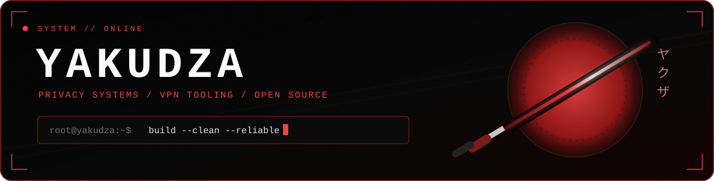

<p align="center">
  
</p>

<p align="center">
  <a href="https://github.com/yakudza0708?tab=repositories"></a>
  <a href="https://github.com/yakudza0708?tab=repositories"></a>
  <a href="https://t.me/warden_sw"></a>
</p>

```text
> whoami
  Developer building privacy-first tools and infrastructure.

> current_focus
  Xray / VPN clients / configuration tooling / service monitoring

> rule
  Complex under the hood. Obvious on the screen.
```

## // FEATURED_BUILDS

<a href="https://github.com/yakudza0708/teapod-stream">
  
</a>
<a href="https://github.com/yakudza0708/xray-config-ui-editor">
  
</a>
<a href="https://github.com/yakudza0708/UptimeKit">
  
</a>
<a href="https://github.com/yakudza0708/virtual-history-explorer">
  
</a>

## // ARSENAL

<p align="center">
  
</p>

<details>
<summary><b>What is behind the projects?</b></summary>
<br />

- **Mobile:** Flutter, Dart, Android VpnService, Xray-core
- **Frontend:** React, TypeScript, Vite, Tailwind CSS, Zustand
- **Backend & infrastructure:** Node.js, Python, PostgreSQL, SQLite, Docker, Nginx, Linux
- **Principles:** self-hosted, observable, resilient, understandable

</details>

## // SIGNAL

<p align="center">
  
</p>

<p align="center">
  <a href="mailto:yakudzadev0708@gmail.com"></a>
  <a href="https://t.me/warden_sw"></a>
</p>

<p align="center">
  <code>切れ味は細部に宿る // the edge lives in the details</code>
</p>
